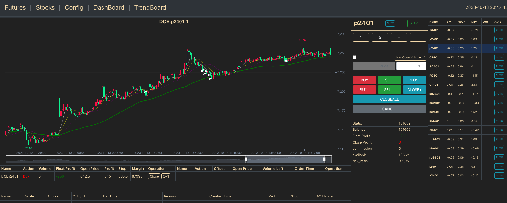
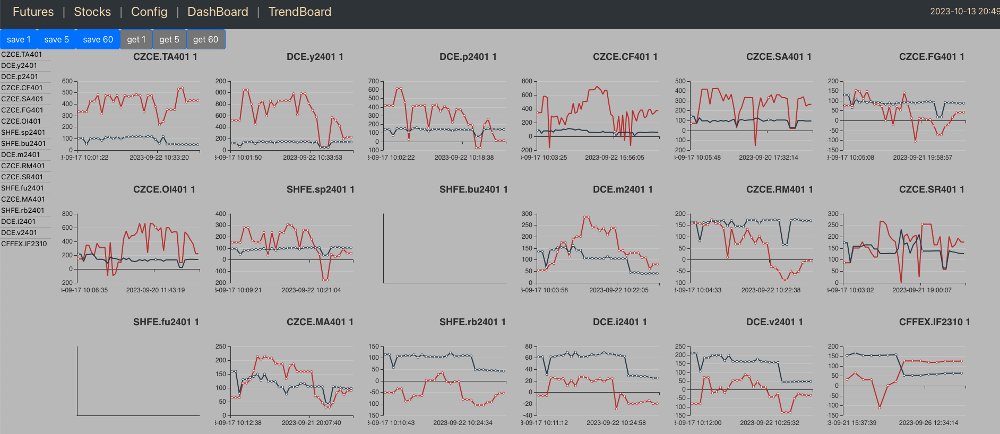

# wsapp

An automatic futures trading web application.
react-eCharts is used to build the UI and use web socket to connect the backend which
implement by python web frame fast-app. The backend service will connect the account from
real futures agent.
People now can trade futures on web seamlessly instead of downloading any desktop
application. People now can write and backtest their own trade strategies and trade the futures
automatically. Any ask or bid prices will be reflected on the UI for easy reference.

1.  your account from tqsdk and futures account from your agent need to update in wsapp/server/appsrv.py

    api = TqApi(
    TqAccount("agent name", "useid", "usepassword"),
    auth=TqAuth("tqsdk_user", "tqsdk_id"),
    )

2.  create engine.py file under wsapp/server/service/, which will be used for your trade strategies

    #sample
    class Engine(object):
    def filter_engine(self, name, price_list, index, need_save=True):
    bar = Bar(name, price_list, index)
    bar_left_1 = Bar(name, price_list, index - 1)
    bar_left_2 = Bar(name, price_list, index - 2)

            # bid
            if bar.ma_5 < bar.ma_10: return service.buy(bar,"2-111",bar.stop("buy"),bar.profit("buy"),need_save=need_save)
            # ask
            if bar.ma_5 > bar.ma_10: return service.sell(bar,"2-000",bar.stop("sell"),bar.profit("sell"),need_save=need_save)
        #close the posistions
        def quit(self, name, price_list, x, record, need_save=True):
            if xxx: return service.buy(bar, "quit", 0, 0, "CLOSE", need_save=need_save)
            if YYY: return service.sell(bar,"quit",0,0,"CLOSE",float(record["stop"]) - bar.tick_size,need_save=need_save,)

UI:
In the futures page - Auto button will enable the automatic trade base on your stragegy

In the Dashboard page - you can do backtest for your stragegy to test if it works

HAVE FUN
